# Cohort Analysis for Assessing Customer Retention in E‑Commerce Industry


## Recruiter‑Optimized Project Summary
End‑to‑end data analytics project demonstrating real‑world business intelligence workflow. This project applies cohort analysis techniques to evaluate customer retention, identify churn patterns, and generate strategic insights that drive revenue growth and customer lifetime value optimization. Designed to showcase skills in data cleaning, transformation, exploratory analysis, visualization, and executive reporting.

---

## Badges


---

## Table of Contents
- Business Context
- Purpose of the Project
- Dataset Description
- Methodology (CRISP‑DM)
- Data Cleaning & Preparation
- Key KPIs & Metrics
- Visual Dashboard
- Presentation Slide
- Key Insights
- Strategic Recommendations
- Tools & Technologies
- Repository Structure
- Conclusion
- Author

---

## Business Context
Customer retention is one of the most critical success factors in e‑commerce. Acquiring new customers costs significantly more than retaining existing ones. Businesses must therefore understand behavioral patterns, repeat purchase cycles, and churn risk. Cohort analysis enables segmentation of users based on acquisition period to track how engagement evolves over time.

---

## Purpose of the Project
The objective of this project is to analyze transactional customer data to:
- Measure retention rates
- Identify high‑value customer segments
- Detect churn trends
- Evaluate lifetime value patterns
- Provide actionable insights for marketing and product strategy

---

## Dataset Description
- Raw Dataset → [Dataset_ecommerce.csv](data/raw/Dataset_ecommerce.csv)  
- Processed Notebook → [solution.ipynb](data/processed/solution.ipynb)

---

## Methodology (CRISP‑DM)
1. Business Understanding — Define retention goals and KPIs
2. Data Understanding — Explore structure, anomalies, missing values
3. Data Preparation — Clean, transform, engineer features
4. Modeling — Build cohort matrices and retention tables
5. Evaluation — Validate trends and business relevance
6. Deployment — Present dashboards and recommendations

---

## Data Cleaning & Preparation
Key preprocessing steps:
- Removed cancelled orders
- Converted invoice dates to datetime format
- Created cohort index variables
- Generated first purchase month
- Built retention matrix tables
- Aggregated customer‑level metrics

---

## Key KPIs & Metrics
- Customer Retention Rate
- Monthly Active Customers
- Repeat Purchase Rate
- Customer Lifetime Value (CLV)
- Churn Rate
- Cohort Survival Rate

---

## Visual Dashboard
[View Dashboard Images](dashboard/)

Sample Visuals:
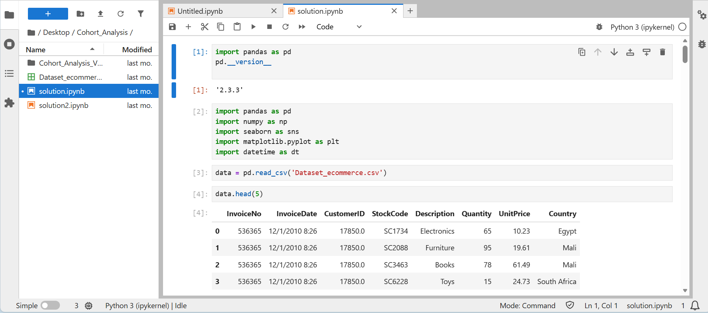  
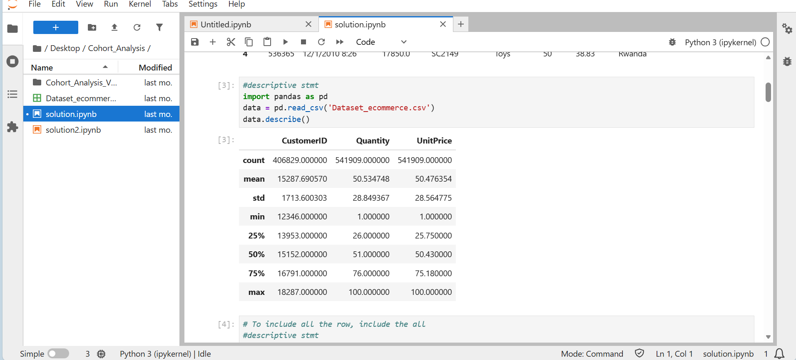  
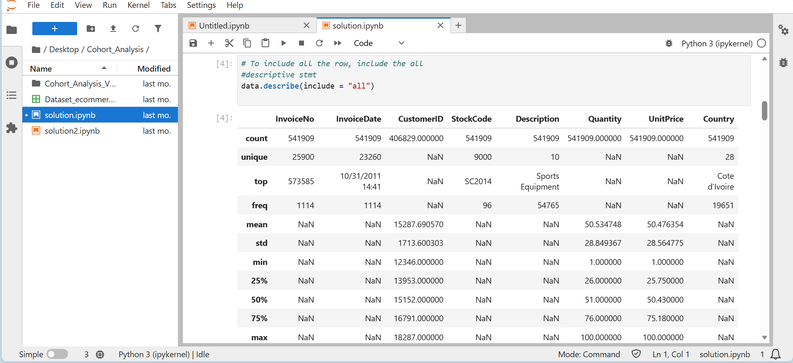  
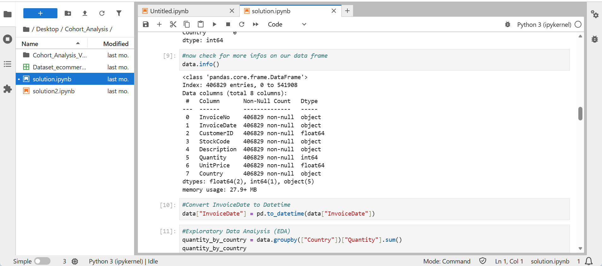  
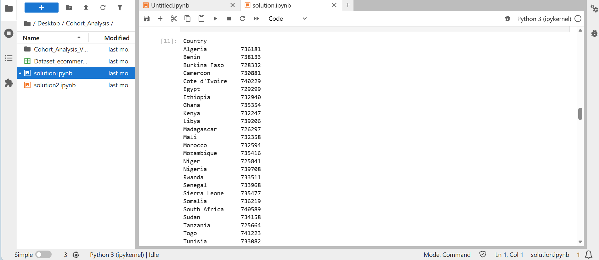
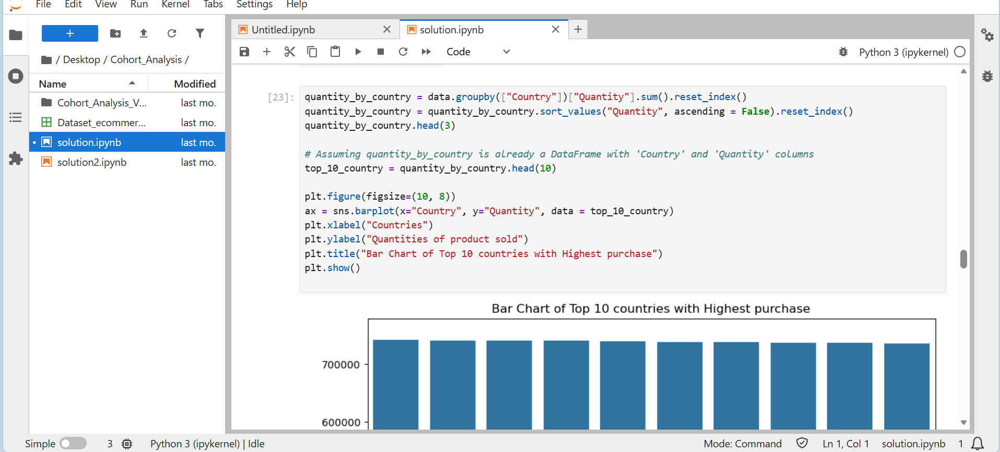
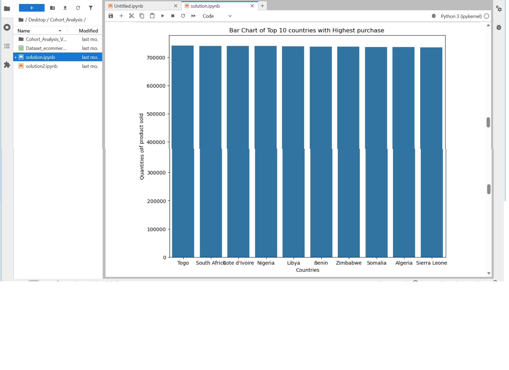
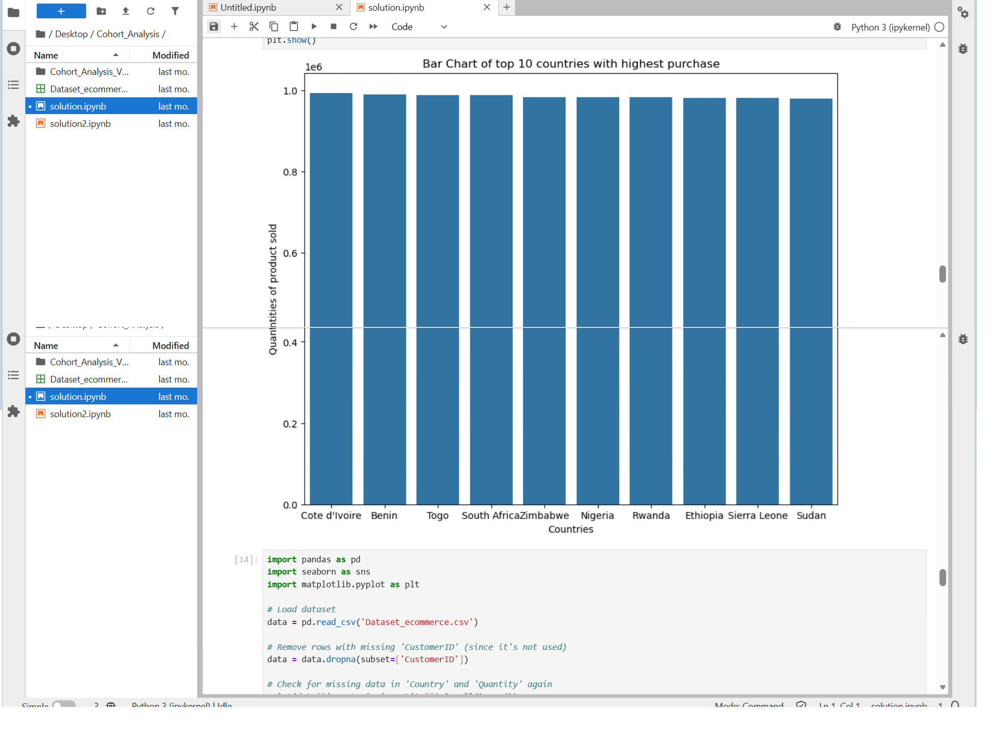
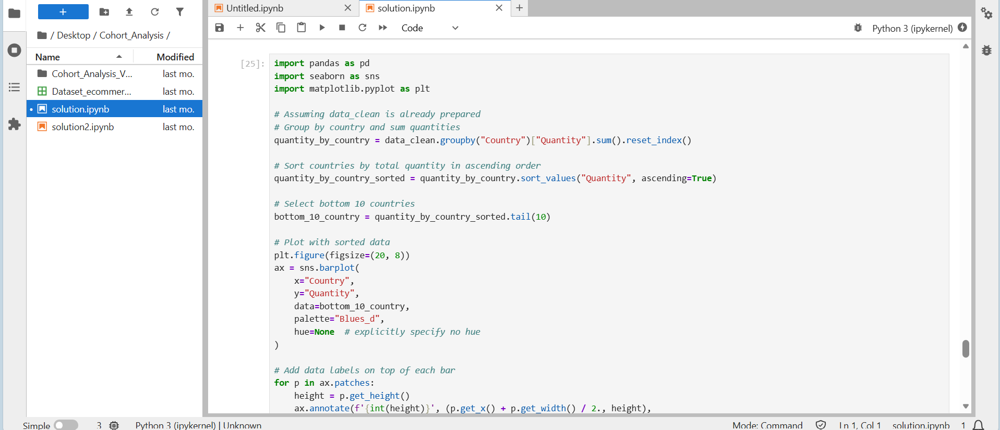
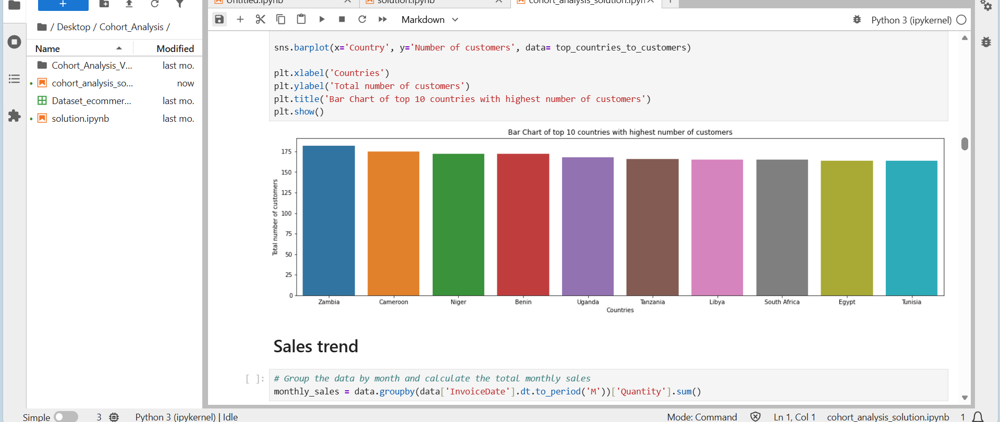
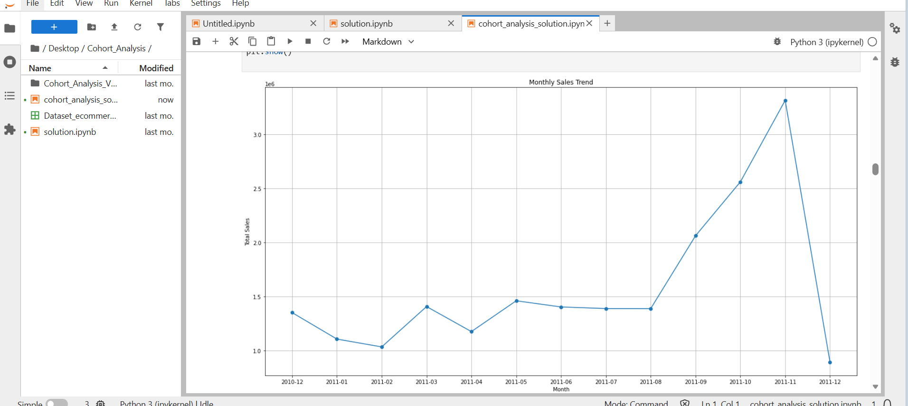
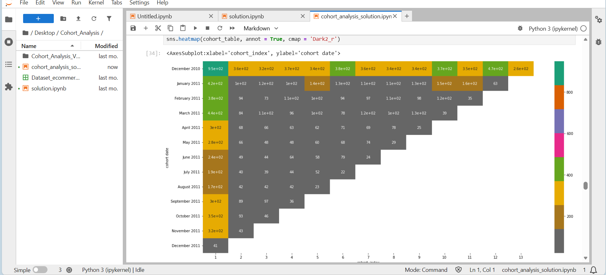
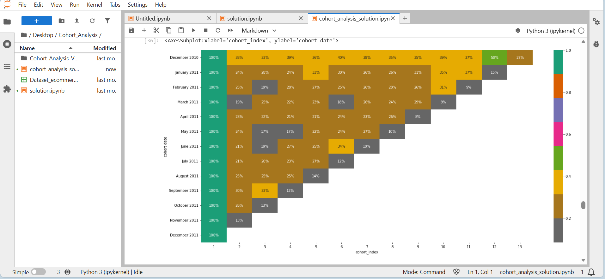


---

## Presentation Slide
[Download Recommendation Slides](slides/recommendation.pptx)

---

## Key Insights
- Early cohorts show strongest retention within first 3 months
- Retention declines significantly after month 6
- High‑value customers tend to purchase within shorter intervals
- Seasonal cohorts exhibit spikes during promotional periods

---

## Strategic Recommendations
- Launch targeted campaigns during first 90 days
- Introduce loyalty programs for repeat buyers
- Re‑engage inactive users using personalized offers
- Prioritize acquisition channels producing highest retention cohorts

---

## Tools & Technologies
- Python
- Pandas
- NumPy
- Matplotlib
- Seaborn
- Jupyter Notebook
- Git & GitHub

---

## Repository Structure
```
Cohort Analysis for assessing customer retention in E-commerce industry/
│
├── data/
│  raw |── [Dataset_ecommerce.csv](data/raw/Dataset_ecommerce.csv)
|
|       |── processed/|── [solution.ipynb](data/processed/solution.ipynb)
│
├── dashboard/
│   |── [pics_1.png](dashboard/pics_1.png)
│   |── [pics_2.png](dashboard/pics_2.png)
│   |── [pics_3.png](dashboard/pics_3.png)
│   |── [pics_4.png](dashboard/pics_4.png)
│   |── [pics_5.png](dashboard/pics_5.png)
│   |── [pics_6.png](dashboard/pics_6.png)
│   |── [pics_7.png](dashboard/pics_7.png)
│   |── [pics_8.png](dashboard/pics_8.png)
│   |── [pics_9.png](dashboard/pics_9.png)
│   |── [pics_10.png](dashboard/pics_10.png)
│   |── [pics_11.png](dashboard/pics_11.png)
│   |── [pics_12.png](dashboard/pics_12.png)
│   |── [pics_13.png](dashboard/pics_13.png)
│
├── slides/
│   |── [recommendation.pptx](slides/recommendation.pptx)
│
├── README.md
└── LICENSE
```

---

## Conclusion
This project demonstrates how cohort analysis can transform raw transactional data into strategic intelligence. By understanding retention patterns, businesses can make informed decisions that improve customer experience, maximize lifetime value, and optimize marketing investments.

---

## Author
**Charles Akintola Walton**  
Data Analyst Consulatnt | Python Developer  
Email: cwalton1335@gmail.com 
LinkedIn: https://linkedin.com/in/cwalton1335
